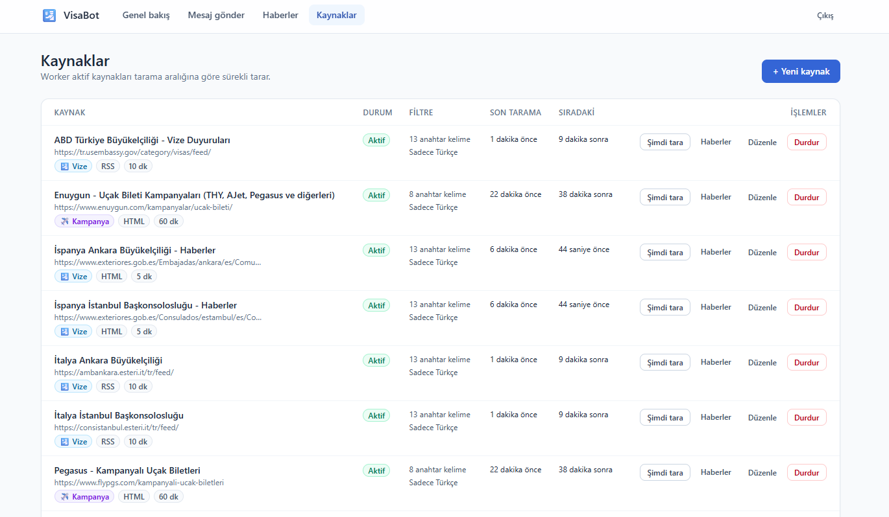
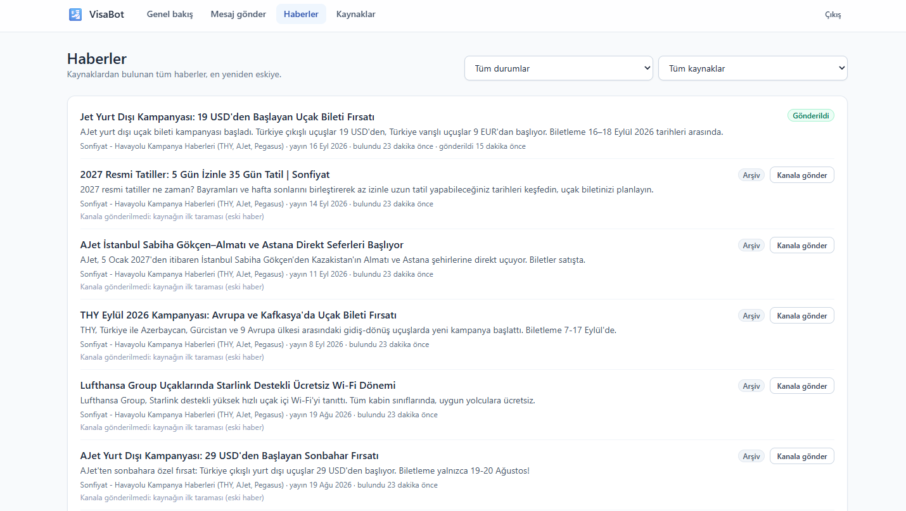
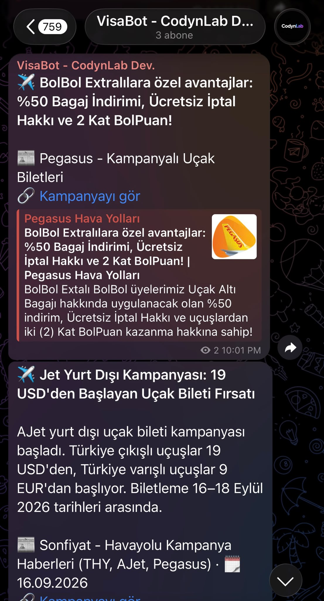

<div align="center">

# 🛂 VisaBot

**Self-hosted news pipeline that watches embassy websites and airline campaign pages,
then publishes what matters to a Telegram channel.**

Built as a production-grade reference for Clean Architecture, DDD and CQRS on .NET 9.

[](LICENSE)
[](https://dotnet.microsoft.com/)
[](https://www.postgresql.org/)
[](https://react.dev/)
[](https://github.com/YusufSizmaz/visa-bot/actions/workflows/ci.yml)

[**Live panel**](https://visa.codynlab.dev) · [**Türkçe README**](README.tr.md) · [**Deployment guide**](DEPLOY.md)

</div>

---

## What it does

Getting a Schengen appointment in Turkey means refreshing a handful of embassy pages several
times a day. VisaBot does that for you.

It polls RSS/Atom feeds and scrapes HTML pages on a per-source schedule, filters entries by
keyword and language, de-duplicates them, and delivers what survives to a Telegram channel —
with retries, rate limiting and an audit trail. The same pipeline also tracks airline campaign
pages, so cheap-ticket announcements land in the same feed.

Everything runs on your own server. There is no SaaS, no account, no cost beyond hosting.

> **Note** — the admin panel at [visa.codynlab.dev](https://visa.codynlab.dev) is API-key
> protected, so the public URL shows a login screen. The screenshots below are what is behind it.

## Screenshots

**Sources** — every source has its own type, interval, keyword filter and health state.



**News** — everything the crawlers found, with why each item was or was not published.



<div align="center">
<strong>Telegram channel</strong> — the end result.<br><br>

</div>

## Features

**Collection**

- RSS and Atom feeds, plus CSS-selector based HTML scraping for sites without a feed
- Per-source polling interval, keyword filter and Turkish-only language filter
- Per-host circuit breaker: one dead site never stalls the healthy ones
- Legacy encodings (windows-1254 and friends) handled transparently

**Delivery**

- Outbox-style queue with exponential backoff and a dead-letter state
- Telegram rate limiting, because `sendMessage` is not idempotent and a naive retry double-posts
- Content-hash unique index as the last line of defence against duplicates
- The first crawl of a new source is archived instead of published, so adding a source never
  floods the channel with months of backlog

**Operations**

- React admin panel: sources, news items, manual channel messages with photo and scheduling
- Fetch a source on demand, pause it, or push any item to the channel by hand — including the
  ones the filters archived, each shown with the reason it was held back
- Health endpoint and structured logs; `/health` is served from the same origin as the panel
- Horizontally scalable workers — the queue is claimed with `FOR UPDATE SKIP LOCKED`

## How it works

```
                 ┌──────────────┐
  RSS / Atom ───▶│              │
  HTML pages ───▶│   Worker     │  polls each source on its own schedule
                 │   (fetch)    │
                 └──────┬───────┘
                        │  filter: keyword, language, age
                        │  de-dupe: SHA-256 content hash + unique index
                        ▼
                 ┌──────────────┐
                 │  PostgreSQL  │  news items, queue, advisory locks
                 └──────┬───────┘
                        │  claim batch: FOR UPDATE SKIP LOCKED
                        ▼
                 ┌──────────────┐       ┌───────────────────┐
                 │   Worker     │──────▶│ Telegram channel  │
                 │  (deliver)   │       └───────────────────┘
                 └──────────────┘
                        ▲
                 ┌──────┴───────┐
                 │   Web API    │◀──── React admin panel (same origin)
                 └──────────────┘
```

A news item moves `Pending → Delivered`, or to `Failed` when attempts run out, or straight to
`Archived` when it was stored deliberately without publishing (first import, too old, or filtered
out). The reason is kept, so the panel can explain every decision.

## Architecture

Clean Architecture with four layers and dependencies pointing inward only:

```
Domain          entities, value objects, domain events — no framework references at all
  ▲
Application     CQRS handlers (MediatR), validation (FluentValidation), port interfaces
  ▲
Infrastructure  EF Core, Npgsql, Telegram, scraping, caching, locking — implements the ports
  ▲
Hosts           WebApi (admin API) and Worker (background jobs)
```

**Layer rules are enforced by tests, not conventions.** `ArchitectureTests` uses NetArchTest to
fail the build if anyone adds an EF Core reference to Domain or a Telegram type to Application.

A few decisions worth calling out, because they are the interesting part of the codebase:

| Concern | Approach |
|---|---|
| Competing consumers | `FOR UPDATE SKIP LOCKED` plus `UPDATE … RETURNING` — claim and mark in one atomic statement, so workers never block each other |
| Distributed locking | PostgreSQL advisory locks, keyed by the SHA-256 of the resource name. No Redis dependency, and a crashed process releases its lock when the connection drops |
| Optimistic concurrency | PostgreSQL's own `xmin` system column instead of a hand-rolled version column |
| Pagination | Keyset (cursor) pagination over `(DiscoveredAtUtc, Id)`, not `OFFSET` |
| Hot-path indexes | Partial indexes covering only pending rows, so the queue index stays small as the table grows |
| Retry policy | A standard resilience pipeline on scraping (idempotent), and deliberately **no** automatic retry on Telegram sends (not idempotent) |
| Domain events | Published only after a successful commit; a failing side effect never fails the transaction |

Comments in the source explain **why** each pattern is there rather than what the code does.
They are written in Turkish, matching the product's audience.

## Tech stack

| Layer | Technology |
|---|---|
| Runtime | .NET 9 |
| Messaging | MediatR (CQRS), FluentValidation |
| Data | PostgreSQL 17, EF Core 9 with Npgsql |
| Cache | HybridCache, optionally backed by Redis |
| Scraping | AngleSharp, `Microsoft.Extensions.Http.Resilience` (Polly) |
| Telegram | Telegram.Bot |
| Logging | Serilog |
| Frontend | React 19, Vite, TypeScript, Tailwind CSS, TanStack Query |
| Tests | xUnit, NSubstitute, Testcontainers, NetArchTest |
| Delivery | Docker, nginx, Coolify |

## Getting started

Requirements: [.NET 9 SDK](https://dotnet.microsoft.com/download), [Node.js 22+](https://nodejs.org/),
[Docker](https://docs.docker.com/get-docker/).

```bash
git clone https://github.com/YusufSizmaz/visa-bot.git
cd visa-bot

cp .env.example .env            # fill in the values
docker compose up -d postgres redis
```

Then run the three parts:

```bash
dotnet run --project src/VisaTelegramBot.WebApi             # http://localhost:5127
dotnet run --project src/VisaTelegramBot.Worker
npm --prefix web/admin ci && npm --prefix web/admin run dev # http://localhost:5173
```

The API applies migrations on startup and seeds a starter set of sources, so the panel has
something to show on the first run.

To run the whole system in containers instead:

```bash
docker compose --profile app up -d --build
```

### Configuration

Keep secrets out of `appsettings.json`. Locally, use user-secrets:

```bash
dotnet user-secrets set "Telegram:BotToken" "<from @BotFather>" --project src/VisaTelegramBot.Worker
dotnet user-secrets set "Telegram:ChannelId" "@your_channel"    --project src/VisaTelegramBot.Worker
```

| Setting | Purpose |
|---|---|
| `ConnectionStrings:Database` | PostgreSQL connection string |
| `ConnectionStrings:Redis` | Optional — without it, caching stays in-process |
| `Telegram:BotToken` | Bot token; the bot must be an admin of the channel |
| `Telegram:ChannelId` | Target channel, for example `@my_channel` |
| `Security:ApiKey` | Admin panel key, minimum 16 characters |

## Testing

```bash
dotnet test
```

157 tests across four projects: domain rules, application handlers, architecture constraints, and
integration tests that run against a **real PostgreSQL instance** — locks, unique indexes and SQL
translation cannot be verified against an in-memory fake.

The integration tests start a throwaway PostgreSQL container through Testcontainers when Docker
is running, use `VISABOT_TEST_POSTGRES` if you point it at your own server, and skip themselves
when neither is available.

## Deployment

The repository ships a production compose stack that exposes a single service to the internet:
the admin container serves the SPA and reverse-proxies `/api` to the backend, so one domain and
one certificate cover everything. Database, cache and API stay on the internal network.

See **[DEPLOY.md](DEPLOY.md)** for the full Coolify walkthrough, the required environment
variables, backups, and the gotchas we hit along the way.

## Project layout

```
src/
  VisaTelegramBot.Domain          entities, value objects, domain events
  VisaTelegramBot.Application     CQRS handlers, validators, port interfaces
  VisaTelegramBot.Infrastructure  EF Core, scraping, Telegram, caching, locking
  VisaTelegramBot.WebApi          admin API
  VisaTelegramBot.Worker          fetch and delivery background services
tests/
  VisaTelegramBot.Domain.Tests
  VisaTelegramBot.Application.Tests
  VisaTelegramBot.ArchitectureTests
  VisaTelegramBot.IntegrationTests
web/admin                         React admin panel
```

## Contributing

Issues and pull requests are welcome — see **[CONTRIBUTING.md](CONTRIBUTING.md)** for the
development setup, review expectations and how to add a news source (usually no code required).

In short: run `dotnet test` and `npm --prefix web/admin run typecheck` before opening a PR, keep
the layer rules intact, and explain **why** in comments rather than what.

Security issues go through [SECURITY.md](SECURITY.md), not public issues. Participation is
covered by our [Code of Conduct](CODE_OF_CONDUCT.md).

## License

[MIT](LICENSE) — free for any use, including commercial. Nothing is required beyond keeping the
copyright notice.

## Authors

| | |
|---|---|
| **Ahmet Emre Cakmak** | [LinkedIn](https://www.linkedin.com/in/ahmet-emre-cakmak/) |
| **Yusuf Can Sızmaz** | [LinkedIn](https://www.linkedin.com/in/yusufsizmaz/) |

<div align="center">
<sub>If this project is useful to you, a ⭐ helps others find it.</sub>
</div>
