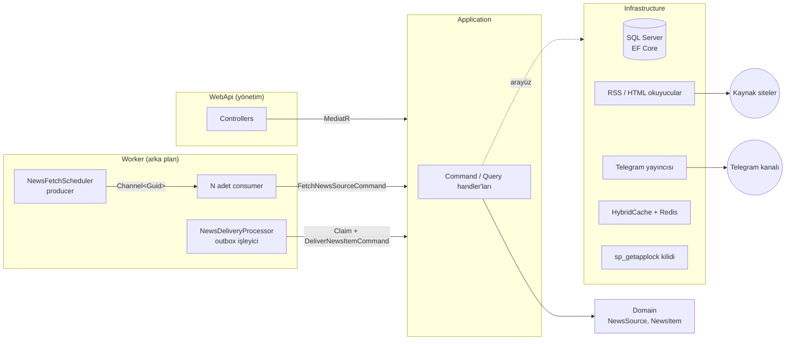

# VisaTelegramBot

Yurt dışı vize haberlerini RSS/Atom beslemelerinden ve HTML sayfalarından toplayıp tek bir Telegram kanalına yayınlayan .NET 9 backend'i.

Proje aynı zamanda bir öğrenme projesidir: Clean Architecture, DDD, SOLID, CQRS ve yüksek trafik desenleri gerçek bir problem üzerinde uygulanmıştır. Kodun içindeki yorumlar her desenin **neden** orada olduğunu anlatır.

---

## İçindekiler

1. [Mimari](#mimari)
2. [Proje yapısı](#proje-yapısı)
3. [Desen haritası](#desen-haritası)
4. [Kurulum](#kurulum)
5. [Çalıştırma](#çalıştırma)
6. [API kullanımı](#api-kullanımı)
7. [Testler](#testler)
8. [Ölçekleme ve bilinçli ödünleşimler](#ölçekleme-ve-bilinçli-ödünleşimler)
9. [Sorun giderme](#sorun-giderme)

---

## Mimari



### Bağımlılık kuralı

Oklar daima içeri doğru. İç katman dış katmanı tanımaz.

| Katman | Tanıdığı | Tanımadığı |
|---|---|---|
| Domain | hiçbir şey | EF Core, MediatR, HTTP, Telegram |
| Application | Domain | SQL, Telegram, AngleSharp, Polly |
| Infrastructure | Application, Domain | WebApi, Worker |
| WebApi / Worker | hepsi (Composition Root) | — |

Bu kurallar `tests/VisaTelegramBot.ArchitectureTests` içinde kodla korunur. Biri Domain'e EF Core referansı eklerse test kırılır.

### Bir haberin yolculuğu

1. **Zamanlayıcı** her 30 saniyede zamanı gelen kaynakları sorar ve kanala yazar.
2. **Tüketici** kaynağı dağıtık kilitle kilitler, beslemeyi indirir ve ayrıştırır.
3. Her kaydın linkinden **parmak izi** (`ContentHash`) üretilir. `utm_*`, `www.`, `http/https` farkları yok sayılır.
4. Veritabanında zaten olan parmak izleri tek sorguda elenir.
5. Yeni haberler `Pending` durumunda kaydedilir. Kaynağın **ilk** başarılı çekimindeki haberler ve çok eski haberler `Archived` olur, kanala dökülmez.
6. **Gönderim işleyicisi** bekleyen haberleri atomik bir SQL sorgusuyla kiralar.
7. Her haber hız limitinden geçip Telegram'a gönderilir; sonuç (`Delivered`, erteleme, yeniden deneme, `Failed`) kaydedilir.

Kaydetme ile gönderme bilinçli olarak ayrıdır. Telegram çökse bile haber kaybolmaz, kuyrukta bekler.

---

## Proje yapısı

```
VisaTelegramBot/
├─ src/
│  ├─ VisaTelegramBot.Domain/          Aggregate'ler, value object'ler, domain event'leri
│  │  ├─ Common/                       Entity, AggregateRoot, ValueObject, WebUrl
│  │  ├─ NewsSources/                  NewsSource aggregate'i
│  │  └─ NewsItems/                    NewsItem aggregate'i, ContentHash
│  ├─ VisaTelegramBot.Application/     Use case'ler (CQRS) ve arayüzler
│  │  ├─ Abstractions/                 Persistence, Scraping, Publishing, Locking, Caching sözleşmeleri
│  │  ├─ Common/                       Result, pipeline behavior'ları
│  │  ├─ NewsSources/                  Create, Update, Activate, Fetch, Queries
│  │  └─ NewsItems/                    Claim, Deliver, Requeue, List
│  ├─ VisaTelegramBot.Infrastructure/  EF Core, okuyucular, Telegram, cache, kilit
│  ├─ VisaTelegramBot.WebApi/          Yönetim API'si
│  └─ VisaTelegramBot.Worker/          Çekim ve gönderim arka plan servisleri
├─ tests/
│  ├─ VisaTelegramBot.Domain.Tests/
│  ├─ VisaTelegramBot.Application.Tests/
│  ├─ VisaTelegramBot.ArchitectureTests/
│  └─ VisaTelegramBot.IntegrationTests/
├─ Directory.Build.props               Tüm projelerin ortak derleme ayarları
├─ Directory.Packages.props            Merkezi paket sürüm yönetimi
├─ docker-compose.yml
└─ .env.example
```

Domain klasörleri türe göre (`Entities/`, `ValueObjects/`) değil **aggregate'e göre** açılmıştır. Bir özelliğe ait her şey yan yanadır.

---

## Desen haritası

| Desen | Nerede | Neden |
|---|---|---|
| **Clean Architecture** | Katman projeleri | İş kuralları framework ve altyapıdan bağımsız kalır |
| **Dependency Inversion** | `Application/Abstractions` | Application "Telegram"ı değil `INewsPublisher`'ı bilir |
| **Aggregate Root** | `NewsSource`, `NewsItem` | Tutarlılık sınırı; durum sadece davranış metotlarıyla değişir |
| **Value Object** | `WebUrl`, `ContentHash`, `HtmlParsingRules` | Primitive Obsession'dan kaçınma; geçersiz değer hiç oluşmaz |
| **Domain Event** | `NewsSourceDeactivatedDomainEvent` vb. | Aggregate olayı ilan eder, tepkiyi dış katman verir |
| **Factory Method** | `NewsSource.Create`, `NewsItem.Discover` | Doğrulanmamış nesne üretimini engeller |
| **Repository + Unit of Work** | `Infrastructure/Persistence` | Aggregate'i bütün olarak yükleme ve atomik kayıt |
| **CQRS** | `ICommand` / `IQuery` + `*Queries` sınıfları | Yazma aggregate üzerinden, okuma `AsNoTracking` projeksiyonla |
| **Mediator** | MediatR | Controller ve Worker handler'ları doğrudan tanımaz |
| **Pipeline Behavior** | `LoggingBehavior`, `ValidationBehavior` | Kesişen ilgiler tek yerde (Decorator + Chain of Responsibility) |
| **Result** | `Common/Results` | Beklenen hatalar exception değil, tipli sonuç |
| **Options** | `*Options` sınıfları | Tipli, başlangıçta doğrulanan ayarlar |
| **Strategy** | `RssNewsFeedReader`, `HtmlNewsFeedReader` | Yeni kaynak tipi = yeni sınıf, mevcut kod değişmez (Open/Closed) |
| **Adapter / Anti-Corruption Layer** | `TelegramNewsPublisher` | Dış kütüphanenin tipleri ve hataları içeri sızmaz |
| **Decorator** | `RateLimitedNewsPublisher` | Yayıncıya dokunmadan hız limiti eklenir |
| **Null Object** | `NullNewsPublisher` | Yayıncısı olmayan host'ta null kontrolü gerekmez |
| **Transactional Outbox** | `NewsItem.DeliveryStatus` | Kayıt ve gönderim ayrı; çökmede haber kaybolmaz |
| **Competing Consumers** | `NewsItemRepository.ClaimSql` | `UPDLOCK, READPAST` ile birden fazla worker aynı haberi almaz |
| **Producer-Consumer** | `NewsFetchScheduler` | Bounded `Channel<T>` ile backpressure |
| **Distributed Lock** | `SqlServerDistributedLockProvider` | Aynı kaynağı iki worker aynı anda çekmez |
| **Retry + Exponential Backoff** | Polly, `NewsItem.CalculateRetryDelay` | Geçici hatalarda artan bekleme |
| **Circuit Breaker + Bulkhead** | `AddStandardResilienceHandler().SelectPipelineByAuthority()` | Çöken site diğer siteleri etkilemez |
| **Rate Limiting** | Token bucket (Telegram), fixed window (API) | Dış servis limitlerine uyum, kötüye kullanım koruması |
| **Cache-Aside** | `HybridCacheService` | Stampede korumalı iki katmanlı cache (bellek + Redis) |
| **Optimistic Concurrency** | `RowVersion` kolonları | Eş zamanlı değişiklik fark edilir |
| **Keyset Pagination** | `NewsItemQueries` | Büyük tabloda sayfa ilerledikçe yavaşlamaz |
| **Idempotency** | `MarkAsDelivered`, `Activate` | Aynı işlemi iki kez yapmak tek sefer yapmakla aynı |
| **Health Check** | `/health` | Orkestratör ve yük dengeleyici için canlılık |
| **Architecture Tests** | NetArchTest | Katman kuralları build'de korunur |

### Özellikle incelenmesi önerilen dosyalar

- `src/VisaTelegramBot.Domain/NewsItems/NewsItem.cs` — zengin domain modeli ve outbox durum makinesi
- `src/VisaTelegramBot.Application/NewsSources/Fetch/FetchNewsSourceCommandHandler.cs` — uçtan uca çekim akışı
- `src/VisaTelegramBot.Infrastructure/Persistence/Repositories/NewsItemRepository.cs` — SQL Server kuyruk sorgusu
- `src/VisaTelegramBot.Infrastructure/Persistence/Configurations/NewsItemConfiguration.cs` — indeks tasarımı
- `src/VisaTelegramBot.Worker/BackgroundJobs/NewsFetchScheduler.cs` — producer-consumer

---

## Kurulum

### Gereksinimler

- .NET 9 SDK (repo `global.json` ile 9.0.3xx'e sabitlenmiştir)
- Visual Studio 2022 17.12 veya üzeri
- Docker Desktop

### 1. Altyapıyı başlat

**Docker ile (önerilen):**

```powershell
cd C:\Users\Pc\Desktop\Project\VisaTelegramBot
copy .env.example .env
docker compose up -d sqlserver redis
```

SQL Server ilk açılışta 20-30 saniye sürebilir. Docker Desktop Windows'ta **WSL 2** ister. Kurulu değilse yönetici PowerShell'de `wsl --install` çalıştırıp bilgisayarı yeniden başlat.

**Docker olmadan (LocalDB ile):**

Visual Studio 2022 ile gelen SQL Server LocalDB yeterlidir. Redis zorunlu değildir; tanımlı değilse cache sadece bellekte tutulur. İki projenin user-secrets deposuna şunları ekle:

```powershell
cd src\VisaTelegramBot.WebApi
dotnet user-secrets set "ConnectionStrings:Database" "Server=(localdb)\MSSQLLocalDB;Database=VisaTelegramBot;Trusted_Connection=True;TrustServerCertificate=True"
dotnet user-secrets set "ConnectionStrings:Redis" ""
```

WebApi ve Worker aynı depoyu paylaştığı için bir kez girmek yeterli.

### 2. Telegram botunu hazırla

1. Telegram'da **@BotFather** ile konuş, `/newbot` yaz ve token'ı al.
2. Bir **kanal** oluştur. Herkese açıksa kullanıcı adı olur, örneğin `@vize_haberleri`.
3. Kanal ayarlarından botu **yönetici** olarak ekle ve "Mesaj gönderme" yetkisi ver.
4. Özel kanal kullanıyorsan sayısal kimlik gerekir (`-100` ile başlar). Kanaldaki bir mesajı **@userinfobot**'a ilet ya da `https://api.telegram.org/bot<TOKEN>/getUpdates` yanıtına bak.

### 3. Gizli bilgileri user-secrets ile ver

Token asla `appsettings.json` içine yazılmaz. WebApi ve Worker aynı user-secrets deposunu paylaşır:

```powershell
cd src\VisaTelegramBot.Worker
dotnet user-secrets set "Telegram:BotToken" "123456789:AA..."
dotnet user-secrets set "Telegram:ChannelId" "@vize_haberleri"
```

Visual Studio'da: Worker projesine sağ tık, **Manage User Secrets**.

---

## Çalıştırma

### Visual Studio 2022 ile

1. `VisaTelegramBot.sln` dosyasını aç.
2. Solution'a sağ tık, **Configure Startup Projects**, **Multiple startup projects**.
3. `VisaTelegramBot.WebApi` ve `VisaTelegramBot.Worker` için **Start** seç.
4. **F5**.

WebApi Development ortamında migration'ları otomatik uygular. API arayüzü: `http://localhost:5127/scalar/v1`

### Komut satırıyla

```powershell
dotnet run --project src\VisaTelegramBot.WebApi
dotnet run --project src\VisaTelegramBot.Worker
```

### Tamamen Docker ile

```powershell
# .env içindeki TELEGRAM_BOT_TOKEN ve TELEGRAM_CHANNEL_ID dolu olmalı
docker compose --profile app up -d --build
```

### Migration

Model değiştiğinde yeni migration üretmek için:

```powershell
dotnet tool restore
dotnet ef migrations add MigrationAdi --project src\VisaTelegramBot.Infrastructure --startup-project src\VisaTelegramBot.Infrastructure --output-dir Persistence/Migrations
```

---

## Kanal mesajları, Türkçe kuralı ve uçuş fırsatları

### Özel mesaj

Panelde **Mesaj gönder** ekranından başlık, metin, link, görsel ve butonlu mesaj yazılır. Sağdaki önizleme mesajın Telegram'da nasıl görüneceğini gösterir. İleri bir tarih seçilirse Worker o saatte gönderir. Zamanlanmış mesaj iptal edilebilir veya hemen gönderilebilir.

Mesajlar da haberler gibi outbox mantığıyla çalışır: önce veritabanına yazılır, Worker kiralayıp gönderir, hata olursa artan aralıklarla yeniden dener. Özel mesajlar otomatik haberlerden önce gönderilir.

Telegram sınırları nedeniyle görselli mesajda başlık ve metin toplamı en fazla 900 karakter, görselsiz mesajda metin en fazla 3500 karakter olabilir. Görsel JPEG, PNG veya WebP, en fazla 5 MB.

### Sadece Türkçe haber

Kaynaklarda **Sadece Türkçe haberleri kanala gönder** seçeneği açıksa İngilizce, İspanyolca gibi dillerdeki haberler kaydedilir ama kanala gitmez. Haberler sayfasında bu haberlerin yanında "Türkçe değil" nedeni ve **Türkçe mesaj yaz** butonu görünür; önemli bir yabancı dil duyurusunu kendi cümlelerinle paylaşabilirsin.

### Uçuş fırsatları

Takip edilen rotalarda (ör. IST → MAD) belirlenen fiyatın altında bilet çıkınca fırsat oluşur. Varsayılan olarak fırsatlar panelde bekler ve sen **Kanala gönder** dersin; rotada otomatik yayın açılırsa onay beklemeden gider. Mesaj Türkçe ve "Bileti incele" butonuyla hazırlanır.

Veri Travelpayouts (Aviasales) Data API'sinden gelir. Ücretsiz kayıt olup token al:

```powershell
cd src\VisaTelegramBot.Worker
dotnet user-secrets set "Travelpayouts:ApiToken" "TOKEN"
# İstersen ortaklık numaran; bilet linklerine eklenir
dotnet user-secrets set "Travelpayouts:Marker" "123456"
```

Fiyatlar son 48 saatte bulunan önbellek fiyatlarıdır, canlı rezervasyon fiyatı değildir; mesajlarda bu uyarı yer alır.

## Yönetim paneli

`web/admin` klasöründe React 19, TypeScript, Vite, TanStack Query, React Router ve Tailwind CSS ile yazılmış bir panel var.

| Ekran | Ne yapar |
|---|---|
| Genel bakış | Gönderim sayıları, API sağlığı, hata veren kaynaklar, kanala son gönderilenler |
| Kaynaklar | Kaynak ekle/düzenle, anahtar kelime ve CSS seçicileri, şimdi tara, durdur/başlat |
| Haberler | Duruma ve kaynağa göre filtre, sonsuz sayfalama, arşivdeki haberi elle kanala gönderme |

### Geliştirmede çalıştırma

Web API çalışırken:

```powershell
cd web\admin
npm install
npm run dev
```

Panel `http://localhost:5173` adresinde açılır. Giriş ekranında Web API'nin `Security:ApiKey` değerini gir, Development ortamında bu `dev-api-key-change-me-please`. Vite, `/api` isteklerini `http://localhost:5127` adresindeki API'ye aktarır; farklı bir adres için `VITE_API_PROXY_TARGET` ortam değişkenini kullan.

### Docker'da

`docker compose --profile app up -d --build` panel dahil her şeyi açar. Panel `http://localhost:3000` adresindedir; nginx statik dosyaları sunar ve `/api` isteklerini API container'ına aktarır.

### Panelde kullanılan desenler

- **Feature klasörleri:** `features/sources`, `features/news` gibi; bir ekranın bileşeni ve hook'ları yan yana.
- **Server state / client state ayrımı:** API'den gelen veri TanStack Query'de, form ve filtre durumu bileşende.
- **API katmanı:** Bileşenler `fetch` kullanmaz. İstekler `api/endpoints.ts`, hata çevirisi `api/client.ts` içinde.
- **Query key fabrikası:** `queryKeys` ile cache anahtarları tek yerde; kayıt sonrası doğru listeler tazelenir.
- **Korumalı rota:** `RequireApiKey`, anahtar yoksa giriş sayfasına yönlendirir. Herhangi bir istek 401 dönerse oturum otomatik kapanır.
- **URL'de filtre:** Haber filtreleri adres çubuğunda tutulur, sayfa yenilense de kaybolmaz.

## API kullanımı

Tüm uçlar `X-Api-Key` başlığı ister. `/health` açıktır. Visual Studio'da `src/VisaTelegramBot.WebApi/VisaTelegramBot.WebApi.http` dosyasındaki istekleri doğrudan çalıştırabilirsin.

| Metot | Yol | Açıklama |
|---|---|---|
| GET | `/api/news-sources?isActive=true` | Kaynakları listele |
| GET | `/api/news-sources/{id}` | Kaynak detayı |
| POST | `/api/news-sources` | Kaynak ekle |
| PUT | `/api/news-sources/{id}` | Kaynağı güncelle |
| POST | `/api/news-sources/{id}/activate` | Aktifleştir |
| POST | `/api/news-sources/{id}/deactivate` | Pasifleştir |
| POST | `/api/news-sources/{id}/fetch` | Beklemeden hemen çek |
| GET | `/api/news-items?status=Pending&cursor=...` | Haberleri listele |
| POST | `/api/news-items/{id}/requeue` | Başarısız haberi yeniden kuyruğa al |
| GET | `/health` | Sağlık kontrolü |

### Örnek: RSS kaynağı ekleme

```http
POST /api/news-sources
X-Api-Key: dev-api-key-change-me-please
Content-Type: application/json

{
  "name": "UK Visas and Immigration",
  "url": "https://www.gov.uk/government/organisations/uk-visas-and-immigration.atom",
  "type": "Rss",
  "fetchIntervalMinutes": 30
}
```

### Örnek: RSS vermeyen bir site

```json
{
  "name": "Örnek Konsolosluk Duyuruları",
  "url": "https://example.com/duyurular",
  "type": "Html",
  "fetchIntervalMinutes": 60,
  "parsingRules": {
    "itemSelector": "div.announcement",
    "titleSelector": "h3",
    "linkSelector": "a.more",
    "summarySelector": "p",
    "publishedAtSelector": "span.date"
  }
}
```

Seçicileri bulmak için tarayıcıda sayfaya sağ tık, **İncele**, haber kartını seç.

### Hazır resmi kaynaklar

WebApi açılışta `src/VisaTelegramBot.WebApi/Seed/news-sources.json` dosyasındaki kaynakları ekler. Aynı adres zaten kayıtlıysa atlar, yani mevcut ayarlarını ezmez.

| Kaynak | Tip | Aralık |
|---|---|---|
| İspanya Ankara Büyükelçiliği haberleri | HTML | 5 dk |
| İspanya İstanbul Başkonsolosluğu haberleri | HTML | 5 dk |
| İtalya İstanbul Başkonsolosluğu | RSS | 10 dk |
| İtalya Ankara Büyükelçiliği | RSS | 10 dk |
| ABD Türkiye Büyükelçiliği vize duyuruları | RSS | 10 dk |
| Enuygun uçak bileti kampanyaları (THY, AJet, Pegasus, SunExpress ve yabancı havayolları) | HTML | 60 dk |
| Pegasus kampanyalı uçak biletleri | HTML | 60 dk |
| Ucuza Uçak bilet ilanları (`feed/?post_type=ucak-bileti`) | RSS | 5 dk |
| Sonfiyat havayolu kampanya haberleri (THY, AJet, Pegasus) | HTML | 60 dk |

Türk Hava Yolları ve AJet siteleri otomatik isteklere yanıt vermediği için kampanyaları Enuygun üzerinden izlenir. iDATA ve VFS Global sayfaları Cloudflare bot korumasıyla otomatik istekleri reddettiği için listede yok. BLS'de randevu durumu sadece giriş ve captcha sonrası göründüğü için izlenmiyor.

### Anahtar kelime filtresi

Resmi kurumlar vize dışında da haber yayınlar. Kaynağa `keywords` listesi verilirse sadece başlığı veya özeti bu kelimelerden birini içeren haberler kanala gönderilir, diğerleri arşivlenir.

- Büyük/küçük harf ve Türkçe karakter duyarsızdır. `randevu` anahtarı "RANDEVULARININ" ile eşleşir.
- Kelime başından eşleşir. `cita` anahtarı "citas" ile eşleşir ama "felicitaciones" ile eşleşmez.
- Birden fazla kelime yazılırsa sıralı öbek olarak aranır, örneğin `"vize başvuru"`.

```json
{
  "name": "Örnek Konsolosluk",
  "url": "https://example.com/feed",
  "type": "Rss",
  "fetchIntervalMinutes": 10,
  "keywords": ["randevu", "vize", "appointment", "cita"]
}
```

Filtreyi kaldırmak için `PUT` isteğinde `keywords` alanını boş gönder.

### Kaynak seçerken

- Önce resmi RSS/Atom beslemelerine bak. GOV.UK'deki her kurum sayfasının sonuna `.atom` eklenince besleme gelir.
- Sitenin kullanım şartlarına ve `robots.txt` dosyasına uy. Çekim aralığını gereksiz kısa tutma.
- Bazı siteler bot korumasıyla otomatik istekleri reddeder (HTTP 403/405). Böyle bir kaynak art arda 5 hatadan sonra otomatik pasife alınır.

---

## Testler

```powershell
dotnet test
```

| Proje | İçerik | Docker gerekir mi |
|---|---|---|
| Domain.Tests | Aggregate kuralları, value object'ler | Hayır |
| Application.Tests | Handler'lar (NSubstitute ile), validator'lar, pipeline | Hayır |
| ArchitectureTests | Katman bağımlılık kuralları, kapsülleme | Hayır |
| IntegrationTests | RSS/HTML okuyucular, mesaj biçimi, EF modeli | Hayır |
| IntegrationTests (SQL) | Kuyruk kiralama, dağıtık kilit, unique index, sayfalama | Docker **veya** mevcut bir SQL Server |

SQL testleri gerçek bir SQL Server ister. İki yol var:

- **Docker çalışıyorsa** Testcontainers geçici bir SQL Server container'ı açar ve test bitince siler.
- **Docker yoksa** Visual Studio ile gelen LocalDB kullanılabilir. Testler rastgele adlı ayrı bir veritabanı açar ve sonunda siler:

```powershell
$env:VISABOT_TEST_SQLSERVER = "Server=(localdb)\MSSQLLocalDB;Trusted_Connection=True;TrustServerCertificate=True"
dotnet test
```

İkisi de yoksa SQL testleri hata vermez, "atlandı" olarak raporlanır.

---

## Ölçekleme ve bilinçli ödünleşimler

### Yatay ölçekleme

- **Worker** birden fazla kopya çalışabilir. Kaynak çekimi dağıtık kilitle, gönderim kiralama sorgusuyla korunur.
- **WebApi** durumsuzdur, yük dengeleyici arkasında çoğaltılabilir. Redis tanımlıysa cache kopyalar arasında paylaşılır.

### Bilinmesi gereken sınırlar

- **Gönderim "en az bir kez" garantilidir.** Telegram mesajı gönderilip sonuç veritabanına yazılamadan process çökerse haber tekrar gönderilebilir. Dağıtık sistemlerde karşı taraf idempotency anahtarı desteklemedikçe "tam bir kez" mümkün değildir.
- **Telegram hız limiti process içindedir.** Üç Worker kopyası toplamda üç kat hızla gönderir. Kanal başına dakikada 20 mesaj sınırı aşılırsa Telegram 429 döner; sistem bunu yakalayıp erteler. Kesin global limit gerekiyorsa Redis tabanlı bir limiter eklenmelidir.
- **Cache geçersiz kılma** diğer API kopyalarının belleğinde en fazla bir dakika gecikebilir.
- **Domain event'leri** kayıttan sonra aynı process'te yayınlanır. Şu anki handler'lar sadece loglama ve cache temizliği yaptığı için yeterlidir. Kritik yan etkiler eklenirse ayrı bir outbox tablosuna geçilmelidir.
- **GUID ve SQL Server:** `Guid.CreateVersion7()` .NET'te zaman sıralıdır ama SQL Server `uniqueidentifier` değerlerini farklı bayt sırasıyla karşılaştırır. Bu yüzden birincil anahtar nonclustered, clustered index ise zaman kolonundadır. PostgreSQL kullanılsaydı bu ayrıma gerek kalmazdı.
- **MediatR 12.5.0** Apache-2.0 lisanslı son sürümdür. 13 ve sonrası ticari kullanımda lisans ister.

### Sonraki adım fikirleri

- Kaynak başına ETag / Last-Modified ile koşullu istek (bant genişliği tasarrufu)
- Kullanıcı bazlı abonelik ve ülke filtresi (fan-out ve kuyruk gerektirir)
- OpenTelemetry ile dağıtık izleme ve metrikler
- Aynı haberin farklı linklerle gelmesine karşı başlık benzerliği kontrolü

---

## Sorun giderme

**Worker açılışta "Telegram:BotToken zorunlu" diyerek duruyor.**
User-secrets ayarlanmamış. [Kurulum 3. adım](#3-gizli-bilgileri-user-secrets-ile-ver).

**Haberler kaydediliyor ama kanala gelmiyor.**
`GET /api/news-items?status=Pending` ile `lastDeliveryError` alanına bak. "chat not found" veya 403 görüyorsan bot kanala yönetici olarak eklenmemiştir.

**Yeni eklediğim kaynak hiç haber göndermedi.**
Bu beklenen davranış. İlk çekimdeki tüm haberler arşivlenir ki kanal eski haberlerle dolmasın. Sonraki çekimlerde gelen yeni haberler gönderilir. Bir haberi yine de göndermek istersen `requeue` ucunu kullan.

**`dotnet test` sırasında "Uygulama Denetimi ilkesi bu dosyayı engelledi" hatası.**
Windows Smart App Control yeni derlenmiş imzasız bir test DLL'ini engellemiş olabilir. Şununla dene:

```powershell
dotnet test -p:Deterministic=false
```

**Docker Desktop "unable to start" diyor.**
Windows'ta WSL 2 kurulu değildir. Yönetici PowerShell'de `wsl --install`, ardından yeniden başlatma. Beklerken LocalDB yolunu kullanabilirsin.

**Visual Studio "proje yeniden yüklensin mi" diye soruyor.**
Solution dosyası dışarıdan değiştirildiğinde olur. **Reload All** seç.
# visa-bot

